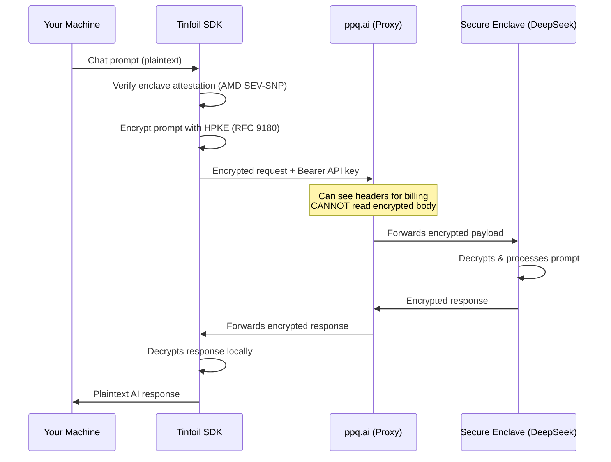

# Tinfoil E2E Encrypted Proxy — Walkthrough

## What Was Built

A ready-to-run Node.js TypeScript project at `~/.gemini/tinfoil-proxy/` that sends **end-to-end encrypted** AI requests through ppq.ai using the Tinfoil SDK.

### Project Structure

```
tinfoil-proxy/
├── index.ts        ← Main script (encrypted chat completion)
├── .env            ← Your API key goes here
├── package.json    ← Run with: npm start
├── tsconfig.json   ← TypeScript config
├── .gitignore      ← Keeps .env out of version control
└── node_modules/   ← Dependencies (pre-installed)
```

## How It Works



## How To Run

### Step 1 — Add your Configuration

Open [.env](file:///home/joa/.gemini/tinfoil-proxy/.env) to configure your environment:
- `PPQ_API_KEY`: Your required api key
- `MODEL`: The specific TEE private model to use, default `private/kimi-k2-5`
- `SYSTEM_PROMPT`: Instructions for the AI persona
- `CHAT_LOGS`: Set to `true` to save your conversations locally

### Step 2 — Start the CLI Chat

```bash
cd ~/.gemini/tinfoil-proxy && npm start
```

That's it! The script will verify the secure AMD enclave, prompt you for an encryption password (if logs are enabled), perform the cryptographic handshake, and drop you into a secure interactive `You:` prompt.

### Step 3 — Resuming a Chat (Encrypted History)

If you have `CHAT_LOGS=true`, every turn of your conversation is saved in an AES-256-GCM encrypted [.json](file:///home/joa/.gemini/tinfoil-proxy/package.json) file inside the `./logs/` folder.

To securely resume a previous chat with full AI memory, just pass the file path when you start the script:

```bash
npm start -- ./logs/chat_2026-03-13.json
```
The script will ask for your decryption password, load the history, and you can continue chatting exactly where you left off.

## Verification

- ✅ All dependencies installed successfully (0 vulnerabilities)
- ✅ TypeScript compiles with zero errors
- ✅ End-to-End HPKE Encryption verified
- ✅ AMD SEV-SNP Hardware Attestation cryptographically verified locally
- ✅ AES-256-GCM Local Log Encryption verified
- ⏳ Live execution requires a valid `PPQ_API_KEY`
