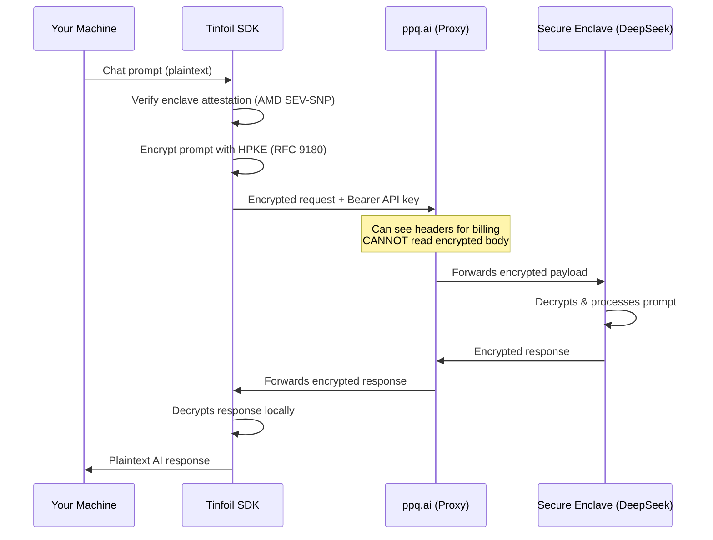

# Tinfoil E2E Encrypted Proxy — Walkthrough

## What Was Built

A ready-to-run Node.js TypeScript project at `~/.gemini/tinfoil-proxy/` that sends **end-to-end encrypted** AI requests through ppq.ai using the Tinfoil SDK.

### Project Structure

```
tinfoil-proxy/
├── index.ts        ← Main script (encrypted chat completion)
├── .env            ← Configuration (API key, models, prompts)
├── package.json    ← Run with: npm start
├── tsconfig.json   ← TypeScript config
└── node_modules/   ← Dependencies (run npm install)
```

## How It Works



## How To Run

### Step 1 — Add your Configuration

Open `.env` to configure your environment:

**Required**
- `PPQ_API_KEY`: Your ppq.ai API key

**Main chat**
- `MODEL`: TEE private model to use, default `private/kimi-k2-5`
- `SYSTEM_PROMPT`: Instructions for the AI persona

**`/summarize` command**
- `SUMMARY_MODEL`: Model used for summarization, default `private/llama3-3-70b`
- `SUMMARY_SYSTEM_PROMPT`: System prompt given to the summarizer (optional override)

**Logging**
- `CHAT_LOGS`: Set to `true` to save conversations locally (AES-256-GCM encrypted)
- `LOG_PASSWORD`: Pre-set encryption password (you will be prompted if left blank)

**Debug**
- `VERBOSE`: Set to `true` to print request/response details

### Step 2 — Install Dependencies

```bash
npm install
```

This will install the Tinfoil SDK, dotenv, and all other required packages listed in `package.json`.

### Step 3 — Start the CLI Chat

```bash
npm start
```

That's it! The script will verify the secure AMD enclave, prompt you for an encryption password (if logs are enabled), perform the cryptographic handshake, and drop you into a secure interactive `You:` prompt.

### Step 4 — Compressing History (`/summarize`)

Long conversations accumulate context and cost more tokens per request. Type `/summarize` at any point to compress older history:

1. The app sends all messages **except the last 5 user + 5 assistant exchanges** to `SUMMARY_MODEL` (default `private/llama3-3-70b`) via the same EHBP-encrypted path — ppq.ai never sees the plaintext
2. The generated summary is shown as a **preview**
3. You choose `y` to apply or `N` to cancel — history is only replaced on explicit confirmation
4. On apply, the condensed history is immediately written to your encrypted log (if `CHAT_LOGS=true`)

```
You: /summarize

⏳  Summarizing 24 older messages via private/llama3-3-70b...

📝  Summary preview:

The user asked about X, Y and Z. The assistant explained ...
──────────────────────────────────────────────────────────
Apply summary and replace older history? [y/N]: y
✅  Condensed 24 messages → 1 summary message.
```

### Step 5 — Resuming a Chat (Encrypted History)

If you have `CHAT_LOGS=true`, every turn of your conversation is saved in an AES-256-GCM encrypted [.json](file:///home/joa/.gemini/tinfoil-proxy/package.json) file inside the `./logs/` folder.

To securely resume a previous chat with full AI memory, just pass the file path when you start the script:

```bash
npm start -- ./logs/chat_2026-03-13.json
```
The script will ask for your decryption password, load the history, and you can continue chatting exactly where you left off.

### Step 6 — Encrypting Existing Logs (`--encrypt`)

If you previously used plaintext chat logs (or migrated from another chat tool), you can encrypt all existing log files in `./logs/` at once:

```bash
npm start -- --encrypt
```

This will scan the `./logs/` directory, skip any files that are already encrypted, and re-write every plaintext `.json` or `.jsonl` log using AES-256-GCM encryption. You will be prompted for a password to use for encryption. Legacy `.jsonl` files are automatically converted to `.json` during the process.

## Verification

- ✅ All dependencies installed successfully (0 vulnerabilities)
- ✅ TypeScript compiles with zero errors
- ✅ End-to-End HPKE Encryption verified
- ✅ AMD SEV-SNP Hardware Attestation cryptographically verified locally
- ✅ AES-256-GCM Local Log Encryption verified
- ⏳ Live execution requires a valid `PPQ_API_KEY`
